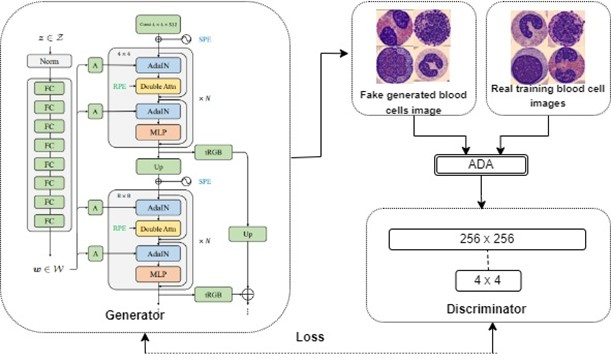
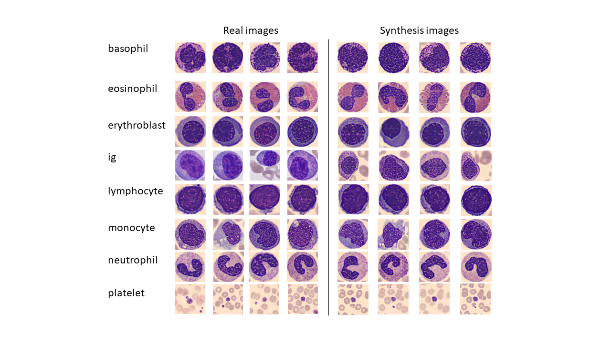

# StyleSwin-ADA



This repo is the official implementation of "Training swin transformer-based GAN for high-resolution blood cell imaging with limited data". 

## Abstract

> Background: Generative AI for image-to-image generation delivers state-of-the-art results in various computer vision tasks, often requiring extensive datasets for accurate and high-resolution image synthesis. Recently, StyleSwin, a transformer-based image generative model, has emerged as a strong competitor to convolutional models like StyleGAN in high-resolution image generation. Convolutional models tend to focus on local patterns, neglecting global patterns, whereas StyleSwin captures both, enhancing image quality.
Aim: However, training StyleSwin on limited data can lead to discriminator overfitting, causing training instability. This issue is particularly relevant for medical data, which is often limited and multi-class. To address this, we propose an adaptive discriminator augmentation (ADA) mechanism for StyleSwin, aiming to stabilize training in data-constrained environments.
> Methodology: The original StyleSwin implementation utilized Swin Transformer blocks in the generator and included a style injection mechanism, achieving state-of-the-art results in high-resolution image generation. By incorporating ADA, we have generated high-resolution medical images despite data constraints.
Results and Conclusion: Medical imaging faces challenges such as the scarcity of high-resolution images, limited data, and artifacts. Our approach using ADA addresses these issues. In this study, we trained StyleSwin with ADA on blood cell images, successfully generating artifact-free, multi-class images. The generated images were evaluated using FID (Fréchet Inception Distance) score to assess image quality. StyleSwin-ADA generated images outperformed on StyleSwin generated images by FID score.  Additionally, multi-variant principal component analysis was employed to evaluate the patterns in the generated images.

## Requirements

To install the dependencies:

```bash
python -m pip install -r requirements.txt
```

## Generating image samples with pretrained model

To generate 50k image samples of resolution **256** and evaluate the fid score:

```bash
python -m torch.distributed.launch --nproc_per_node=1 train_styleswin.py --sample_path /path_to_save_generated_samples --size 256 --G_channel_multiplier 2 --ckpt /path/to/checkpoint --eval --val_num_batches 600 --val_batch_size 4 --eval_gt_path /path_to_real_images
```

## Training

To train a new model of **bloodcell-256** :

```bash
python -m torch.distributed.launch --nproc_per_node=2 train_styleswin.py \
 --batch 4 --path /path_to_bloodcell_images_256 \
 --checkpoint_path /tmp --sample_path /tmp --size 256 \
 --G_channel_multiplier 2 --bcr --r1 5 --D_lr 0.0002 --D_sn --ttur --val_batch_size 4 --eval_freq 20000  --val_num_batches 600 \
 --eval_gt_path  /real_images_path_to_bloodcell_images_256
```

## Results 


## Reference

Zhang, Bowen, Shuyang Gu, Bo Zhang, Jianmin Bao, Dong Chen, Fang Wen, Yong Wang, and Baining Guo. "Styleswin: Transformer-based gan for high-resolution image generation." In Proceedings of the IEEE/CVF conference on computer vision and pattern recognition, pp. 11304-11314. 2022.

Karras, Tero, Miika Aittala, Janne Hellsten, Samuli Laine, Jaakko Lehtinen, and Timo Aila. "Training generative adversarial networks with limited data." Advances in neural information processing systems 33 (2020): 12104-12114.

## Acknowledgements

This code borrows heavily from [StyleSwin]([https://github.com/microsoft/StyleSwin]) and [Stylegan2-ada-pytorch]([https://github.com/microsoft/Swin-Transformer]).
